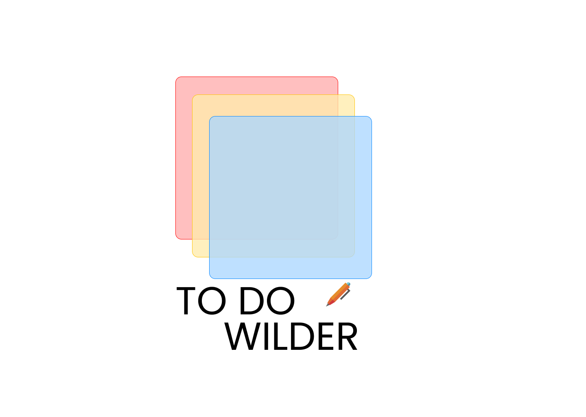

# 🗒️✔️ To Do Wilder 🖊️🗃️

## ✨📄Libérez votre esprit, faites une todolist 🧠💭

### Description

Dans le cadre du Projet 1 du bootcamp de la Wild Code School pour devenir développeur web full stack, nous avons développé une application de gestion de tâches accessible sur desktop et mobile. <br/>
💻 Utilisant HTML, CSS et JavaScript, cette application s'est concentrée sur la réactivité et l’adaptabilité des interfaces.<br/>
📝 Les utilisateurs pouvaient créer des todolists sous forme de post-its et les organiser librement sur leurs écrans, offrant ainsi une expérience de gestion des tâches personnalisée et flexible. <br/>
🎨 Avec la possibilité de changer les couleurs de sont interface mais aussi de ses post-its.

## 📥 Installation

1. Clonez le dépôt :

   ```sh
   git clone git@github.com:???
   ```

## 🛠️ Utilisation

Ouvrez votre navigateur et accédez à `http://localhost:???`.

## 🖼️ Design

- [Fichier Figma <br>
](???)

- [??? <br>](???)

- [??? <br>](???)

## 📂 Structure du projet

```java
???

```

## ✍ Créateurs

- [Adiallo123 <br>
](https://github.com/Adiallo123)  
- [Dampherrr <br>
](https://github.com/dampherrr)  
- [Dilgo-dev <br>
](https://github.com/Dilgo-dev)  
- [RosaBen <br>
](https://github.com/RosaBen)  
  
---
